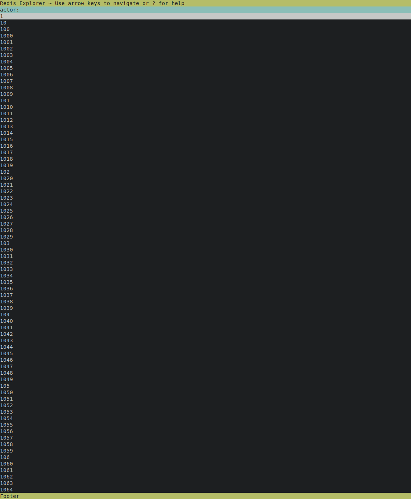

# redex - Redis Explorer - WIP

Redis Explorer using Zig.

This is my first Zig project, and I thought it might be fun to make something
that I wanted. So I deicded that this would be challenging, yet still simple
enough to make in a new language. It's been quite a fun journey. When I am
satisfied with the feature set, a refactor will probably be required.
As well as making sure there's no memory leaks and proper testing.

Some inspiration came from [ncdu](https://dev.yorhel.nl/ncdu)

## Features

- [x] Connect to Redis server, fetch the keys (Still hard coded hostname)
- [x] Split the key names by a separator and create a tree.
- [x] Render the tree using zig-spoon.
- [x] Navigation of the tree. Arrow keys, Page Up/Down will move you around.
      Left/Right arrow key to move up/down the tree.
- [ ] Show number of child keys using a bar graph.
- [ ] Show the consumed memory of the child tree.
- [ ] Delete keys/tree of keys.
- [ ] Rename keys/tree of keys.
- [ ] Dump keys/tree of keys.
- [ ] Command line arguments.
- [ ] Connect to a server over TLS.
- [ ] Colours read from the `dircolors` database / environment variable.

## Sample images

Root of the tree:

One level down, showing the actors:

